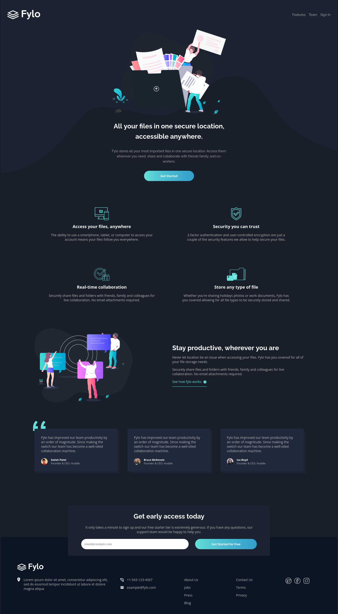

# Frontend Mentor - Fylo dark theme landing page solution

This is a solution to the [Fylo dark theme landing page challenge on Frontend Mentor](https://www.frontendmentor.io/challenges/fylo-dark-theme-landing-page-5ca5f2d21e82137ec91a50fd). Frontend Mentor challenges help you improve your coding skills by building realistic projects.

## Table of contents

- [Overview](#overview)
  - [The challenge](#the-challenge)
  - [Screenshot](#screenshot)
  - [Links](#links)
- [My process](#my-process)
  - [Built with](#built-with)
  - [What I learned](#what-i-learned)
  - [Continued development](#continued-development)
  - [Useful resources](#useful-resources)
- [Author](#author)

## Overview

### The challenge

Users should be able to:

- View the optimal layout for the site depending on their device's screen size
- See hover states for all interactive elements on the page

### Screenshot

### Links

- Solution URL: [Add solution URL here](https://your-solution-url.com)
- Live Site URL: [Add live site URL here](https://your-live-site-url.com)

## My process

### Built with

- Semantic HTML5 markup
- Sass variables
- Sass mixins
- Flexbox
- CSS Grid
- Desktop-first workflow

### What I learned

I applied espacialy what I have learned in CSS grid, including auto-fit, minmax() function for responsive grid design.

### Continued development

I want to do two more things in this project.

1. Scaling the images when screen get smaller.
2. And changing the color of the svg images without using the site below: https://codepen.io/sosuke/pen/Pjoqqp

### Useful resources

- [To learn about grid](https://learncssgrid.com/) - This kind of sites are great when you are trying to learn and check what you trying to remember about a topic. This site is all about learning grid.

## Author

- Frontend Mentor - [@yumelih](https://www.frontendmentor.io/profile/yumelih)
